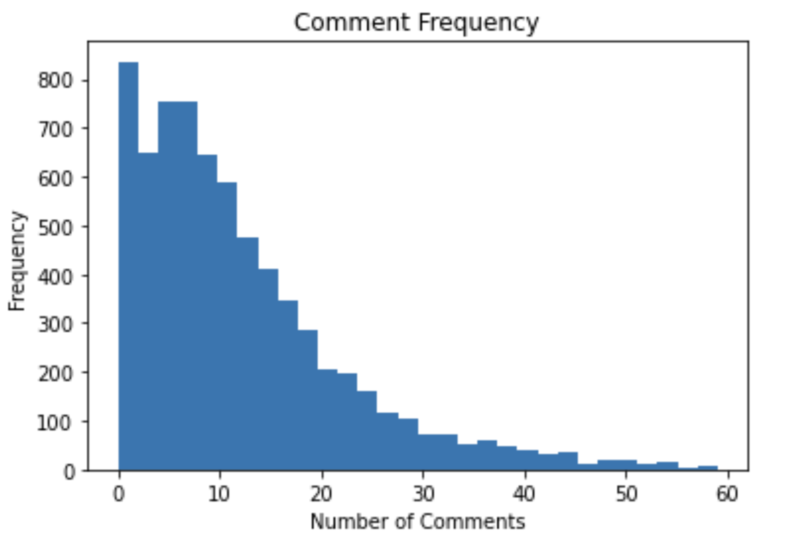
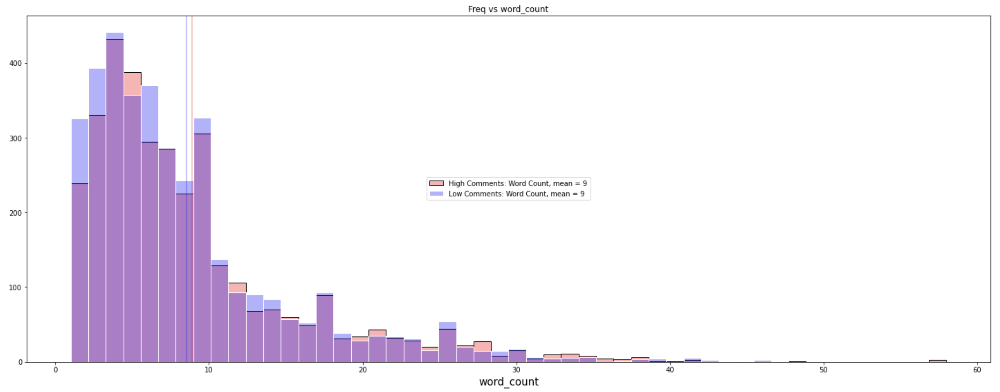
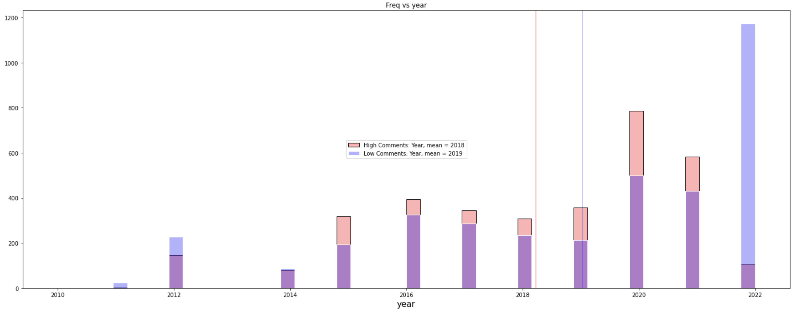

#  Project 3: Web Scraping & Classification

### Description

This goal of this project was to analyze Reddit posts and create a model to predict whether a post would be viral as measured by the number of comments it received compared to the median number.

### Scenario

The creator of the card game Dominion, Donald X. Vaccarino, has contracted me to analyze the sub Reddit r/Dominion and to create a model to predict which types of posts will receive more than average engagemenet as measured through the number of comments on the post compared to the median number of comments. Donald is curious if there are certain types of posts that users tend to engage more with and if there are others that people tend to avoid. 

#### Executive Summary

This project consists of two main steps: collecting data by scraping a website and building a binary predictor.

The problem statement for this project is: _What characteristics of a post on Reddit: r/Dominion are most predictive of the overall interaction on a thread (as measured by number of comments)?_

The main data that was acquired for each post from the subreddit r/Dominion consisted of:
1. The title of the thread
2. The length of time it has been up on Reddit as measured by the day it was posted
3. The number of comments on the thread

Other data that was used in the model consisted of:
1. The length of the title
2. The length of the body of the post (if there was one)
3. Whether media was present in the post

The project goal was to scrape at least 10,000 threads, but only 7,121 posts were available. Project manager, Caroline Schmitt, authorized approval to work on the project despite the full 10,000 training examples.

#### Data Scraping: `dom1_scraping.ipynb`
The data was scraped using the API's PMAW and PRAW. PMAW was used to streamline and speed up the data collection process. Unfortunately, during the modeling process, it was realized that some of the data had errors in it. In particular, many of the posts with supposedly 0 comments on had significantly more. PRAW was used to verify every post with 0 comments actually had 0 comments or to update this value as needed. No other errors were noted, but not every value was double checked due to time constraints.

#### Data Distributions: `dom2_eda.ipynb`
The r/Dominion subreddit is a very active group with significant engagement in posts. The median number of posts was 9 (originally it was 7 before the faulty data was cleaned). In the first plot below, the distribution of number of comments is shown (a cutoff of 60 comments was chosen as the graph has a high right skew). In the second plot, the histogram shows the frequency of words used in the title for posts with high amounts of comments and low amounts. The distributions are very similar. The third plot shows the histogram shows the frequency of high and low commented posts based on the year. A significantly lower amount of posts were made in 2022.

#### Data Modeling: `dom3_model.ipynb` and `dom4_model.ipynb`
The primary data used in the modeling were the words used in the title. A variety of models were tested using just the text data and they nearly all had the same accuracy performance right under 60%. This was improvement over baseline, 51%, by about 8%. The classifiers tested included:
1. Logistic Regression
2. Naïve Bayes (Bernoulli and Multinomial)
3. Random Forest
4. Gradient Boost
5. Ada Boost
6. KNN

For each of these models, a CountVectorizer and TfidfVectorizer were compared and tested using GridSearch on a few parameters. Stemming was applied to all models (including English stop words), while Lemmatization was skipped due to time constraints. However, as stated previously, most of the models had very similar performance right above baseline.

A few models were tested using more features, but due to time constraints, GridSearch was not used with multiple features. The following were models were tested with multiple features:
1. Logistic Regression
2. Naïve Bayes (Bernoulli)
3. Random Forest
4. Extra Trees Boost
5. KNN
6. Support Vector Classifier (SVC)

#### Conclusions
The best model found was the SVC using both a CountVectorizer and TfidVectorizer. A 61.7% accuracy was achieved, about 10% higher than the baseline model. Confusion matrices as well other metrics were calculated in the modeling notebook.

This was a hard data problem and it is unsurprising that the model does not perform better. For a human, it is very difficult to read one of these titles and predict how popular the post will be compared to other posts and there are several reasons for this. A significant amount of information is hidden by just looking at words, in particular, the quality of any attached images is completely neglected. While the model did look at whether media was present, it is impossible to decipher whether the image is engaging or not without doing analysis on it. Further, many of the posts in this subreddit were questions about how the game is played and it is impossible for simple vectorizers to predict whether humans will have significant engagment with the post or just a few responses. Sometimes, a simple answer is all that is needed. Some of the posts did receive a bit of engagement, but were still shy of the median amount! I believe the model was able to pick up some of extreme cases, such as simple questions and spam content.

I do not believe more data or other models would significantly help the model. Modeling a much more measurable task that does not depend on human likes and engagement would be much more achievalbe. Or using a Subreddit with the posts more evenly split between garbage/spam posts and actual content would achieve much higher accuracy scores for this task. Since the Dominion subreddit contains an active and passionate userbase, it is very difficult to achieve a high accuracy on this task. Looking at which posts the model thought would go viral and not, the model increased odds for a post if it contained 'card' or 'expansion' while posts with 'question' in them and posts with unrelated text (spam generally) were often correctly identified. My hypotheses for why posts with 'question' in them received less comments is because once a user answers the questions, there is not much reason for others to post on it. 

